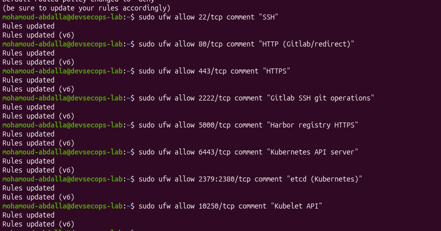
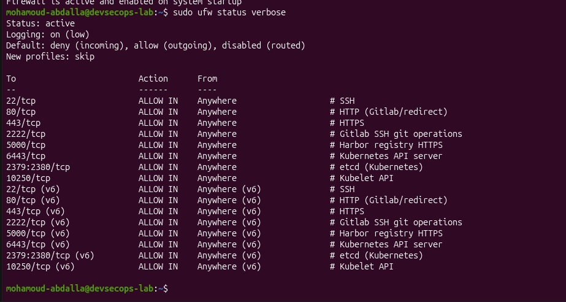
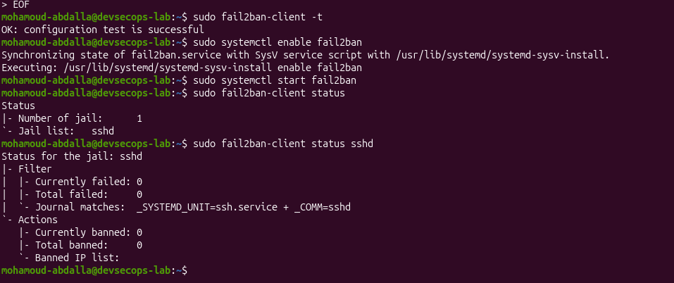
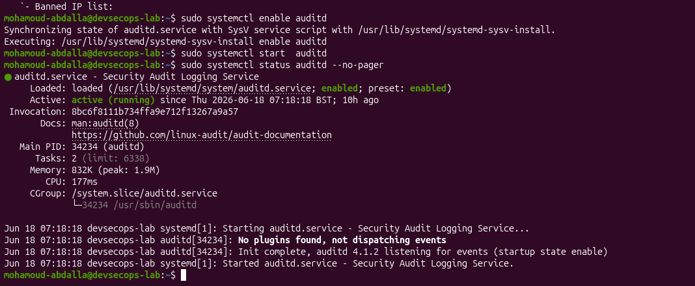
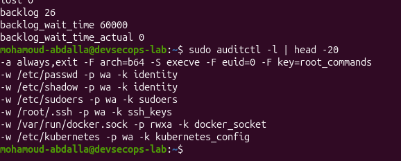

# Phase 1.1 - OS Hardening & System Preparation

This phase establishes the baseline security posture for the Ubuntu lab VM before deploying platform services.

## Completed Controls

### System Updates

The system package index was refreshed and installed packages were upgraded. A reboot check confirmed that no reboot was required.

### Security and Operations Packages

Installed and verified core security and operations tooling:

- UFW
- Fail2Ban
- auditd
- AIDE
- unattended-upgrades
- jq
- yq
- htop
- iotop
- net-tools
- nmap
- python3-pip
- curl
- wget
- git
- ca-certificates
- GnuPG

### Automatic Security Updates

`unattended-upgrades` was configured and enabled to support automatic security patching.

### UFW Firewall

UFW was reset to a clean state and configured with a default-deny inbound posture.

Allowed service ports:

| Port | Purpose |
|---|---|
| 22/tcp | SSH |
| 80/tcp | HTTP / redirect |
| 443/tcp | HTTPS |
| 2222/tcp | GitLab SSH Git operations |
| 5000/tcp | Registry / Harbor HTTPS |
| 6443/tcp | Kubernetes API server |
| 2379:2380/tcp | etcd |
| 10250/tcp | Kubelet API |

UFW was enabled and verified as active.

Original terminal evidence:

### SSH Hardening

OpenSSH server was checked and found not installed. Nothing was listening on port 22.

SSH hardening was deferred because enabling or hardening an unused inbound SSH service would add unnecessary attack surface. This will be revisited if SSH server access becomes required later.

### Fail2Ban

Fail2Ban was configured with a local jail configuration and validated successfully.

Current active jail:

- `sshd`

At verification time, there were no failed attempts and no banned IPs.

Original terminal evidence:

### auditd

`auditd` was enabled and verified as active.

Audit rules were added for:

- root command execution
- `/etc/passwd` changes
- `/etc/shadow` changes
- `/etc/sudoers` changes
- `/root/.ssh` changes
- Docker socket access
- Kubernetes configuration changes

The rules were loaded and verified with `auditctl`.

Original terminal evidence:

## Evidence Handling

Screenshots are stored in `docs/screenshots/` as implementation evidence. They should be redacted before upload and must not expose passwords, tokens, private keys, cloud credentials, or other sensitive material.
