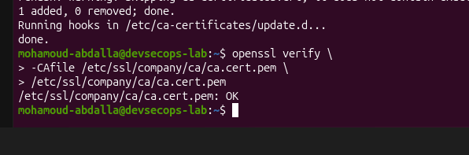
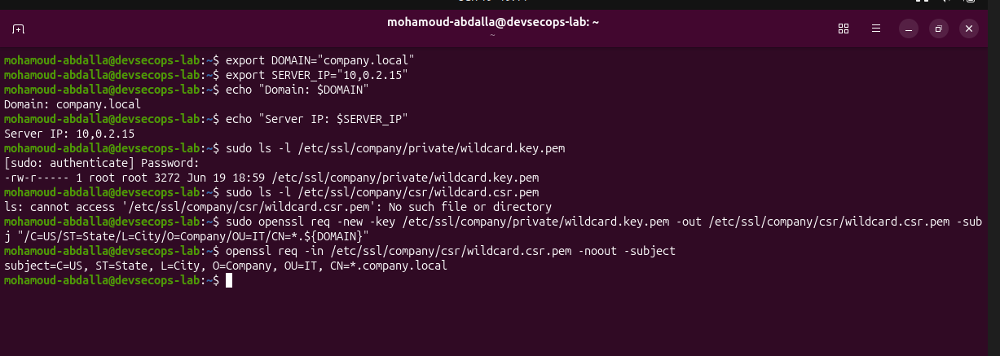
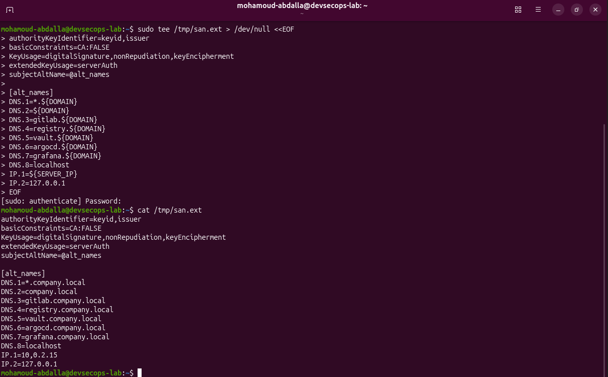
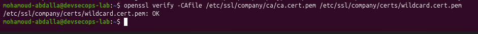
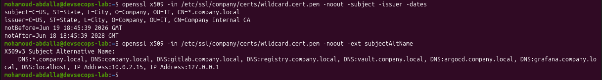
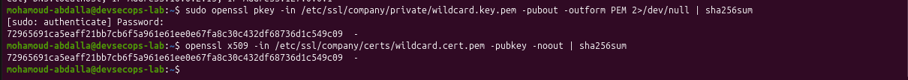

# Phase 1.2 - SSL Certificate Setup

This phase creates an internal certificate authority and service certificates for internal lab services.

## Purpose

Internal services such as GitLab, Vault, Argo CD, Grafana, and the container registry should use HTTPS. The lab uses a private internal CA for self-signed internal trust.

## Status

Phase 1.2 is complete.

Completed work:

- Created PKI directory structure under `/etc/ssl/company/`
- Secured private key directory permissions
- Generated internal CA private key
- Generated internal CA certificate
- Installed the internal CA into the Ubuntu trust store
- Verified the internal CA certificate successfully with OpenSSL
- Generated a 4096-bit wildcard service private key
- Created and verified the wildcard certificate signing request
- Defined DNS and IP Subject Alternative Names
- Signed the wildcard certificate with the internal CA
- Verified the certificate trust chain, identity, issuer, dates, and SANs
- Confirmed the wildcard certificate matches its private key

## PKI Directory Structure

| Path | Purpose |
|---|---|
| `/etc/ssl/company/ca` | Internal CA key and certificate |
| `/etc/ssl/company/certs` | Issued certificates |
| `/etc/ssl/company/private` | Private keys |
| `/etc/ssl/company/csr` | Certificate signing requests |

The private key directory was secured with owner-only access.

## Internal CA

The internal CA is used to sign certificates for lab services. The CA certificate has been added to the local trust store so the VM can trust certificates issued by this CA.

Original terminal evidence:

## Wildcard Certificate

The wildcard certificate is valid for `*.company.local` and includes explicit DNS and IP SAN entries for the internal services and local testing endpoints.

### Certificate Signing Request

Original terminal evidence:

### Subject Alternative Names

Original terminal evidence:

### Trust Chain Verification

Original terminal evidence:

### Certificate Identity And Validity

Original terminal evidence:

### Private Key Match

The SHA-256 hashes of the public keys extracted from the private key and certificate matched exactly.

Original terminal evidence:

## Validation Notes

OpenSSL validation caught a case-sensitive extension-name typo and a malformed IP SAN before certificate issuance. Both were corrected before the certificate was signed, demonstrating why certificate profiles should be validated before deployment.

## Safety Notes

Do not commit private keys, CA keys, passwords, or generated secret material to GitHub.

Files that must stay out of GitHub include:

- `*.key`
- `*.key.pem`
- private CA material
- tokens
- passwords
- cloud credentials
