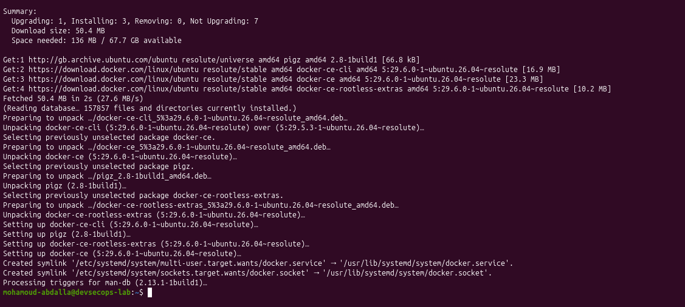
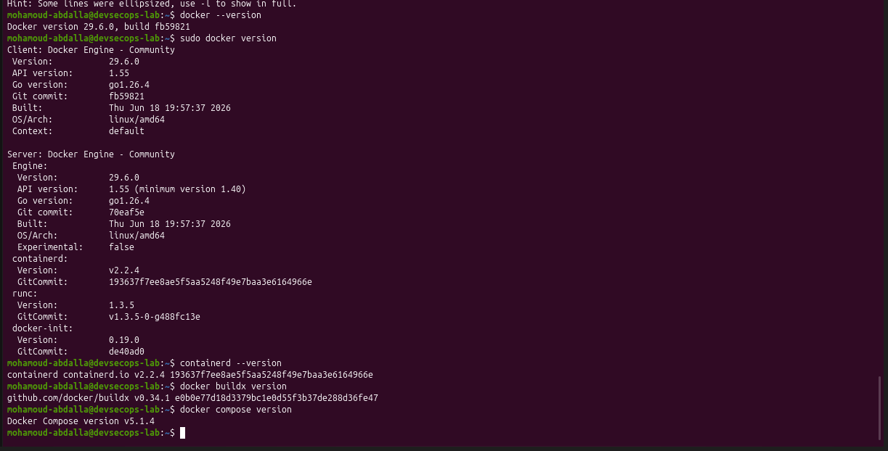
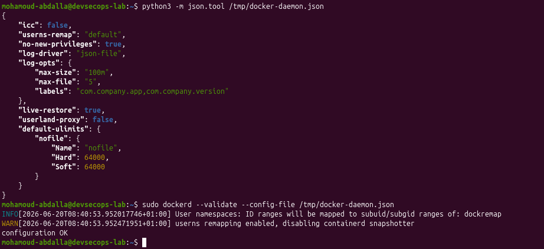
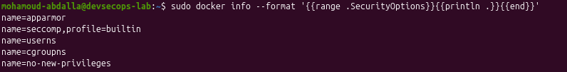
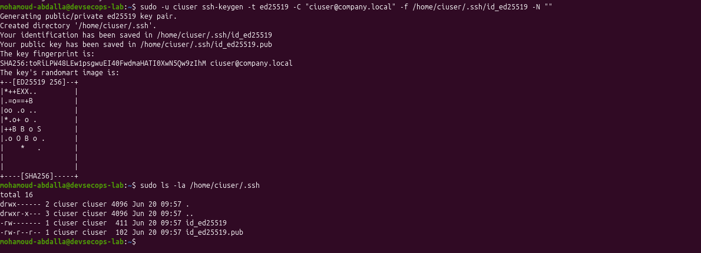
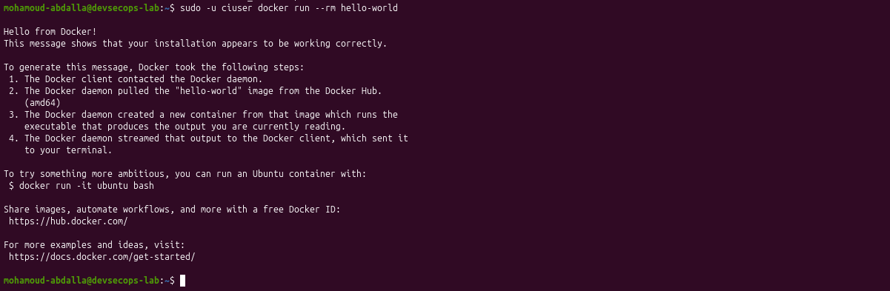

# Phase 1.3 - Docker Engine Installation And Hardening

In this phase, I installed Docker Engine on Ubuntu 26.04, validated the runtime toolchain, hardened the Docker daemon, and created a dedicated CI service identity.

## Status

I have completed Phase 1.3.

Completed work:

- I installed Docker Engine 29.6.0 from Docker's signed Ubuntu Resolute repository.
- I aligned the Docker Engine and CLI versions.
- I verified containerd, runc, Buildx, and Docker Compose.
- I confirmed that Docker was active and enabled at startup.
- I ran a test container before and after daemon hardening.
- I pinned the core runtime packages for lab reproducibility.
- I validated and applied a hardened `daemon.json` configuration.
- I verified AppArmor, seccomp, user namespaces, cgroup namespaces, and no-new-privileges.
- I created a dedicated `ciuser` service account.
- I granted Docker access only to the CI service identity.
- I generated an Ed25519 SSH key pair for future GitLab automation.
- I successfully ran a container as `ciuser`.

## Docker Installation

Package inspection showed that containerd, the Docker CLI, Buildx, and Compose were already present, but Docker Engine was missing. I installed the missing Engine package and aligned the Engine and CLI on version 29.6.0.

Original terminal evidence:

## Runtime Toolchain

I verified the complete toolchain:

| Component | Version |
|---|---|
| Docker CLI | 29.6.0 |
| Docker Engine | 29.6.0 |
| containerd | 2.2.4 |
| runc | 1.3.5 |
| Buildx | 0.34.1 |
| Docker Compose | 5.1.4 |

Original terminal evidence:

## Package Reproducibility

I placed `docker-ce`, `docker-ce-cli`, and `containerd.io` on hold to keep the lab runtime consistent while I complete the build.

I treat this as a controlled lab decision, not a permanent no-patching policy. Held runtime packages require deliberate vulnerability monitoring and scheduled upgrades.

## Docker Daemon Hardening

I created the hardening configuration in a temporary file and validated both its JSON syntax and Docker compatibility before placing it in `/etc/docker/daemon.json`.

Applied controls:

| Control | Purpose |
|---|---|
| Disabled default-bridge ICC | Restrict unrestricted inter-container communication |
| User namespace remapping | Map container root to unprivileged host IDs |
| No new privileges | Prevent container processes from gaining privileges |
| JSON log rotation | Limit container log growth |
| Live restore | Keep containers running during daemon restarts |
| Disabled userland proxy | Reduce reliance on Docker's userland networking proxy |
| Controlled nofile limit | Set a predictable file-descriptor ceiling |

Original terminal evidence:

## Effective Security Controls

After restarting Docker, I verified the effective runtime security options rather than relying only on the configuration file.

Verified controls:

- AppArmor
- seccomp with Docker's built-in profile
- user namespace remapping
- cgroup namespace isolation
- no-new-privileges

Original terminal evidence:

I also verified that Docker created the `dockremap` account and assigned subordinate UID/GID ranges beginning at `100000` with `65536` available IDs.

## Dedicated CI Service Identity

I created `ciuser` as a separate Linux identity for CI/CD automation. This separates pipeline activity from my personal administrator account and improves auditability.

I added only the dedicated CI account to the Docker group. I treat this as privileged access because control of the Docker daemon is effectively root-equivalent.

Original terminal evidence:

## CI SSH Key

I generated an Ed25519 SSH key pair for future GitLab operations. The private key is owned by `ciuser` with mode `600`, and the `.ssh` directory uses mode `700`.

The private key is not stored in this repository.

Original terminal evidence:

## Final CI User Test

I ran `hello-world` as `ciuser` without placing `sudo` inside the Docker command. This verified the service account's Docker group membership, socket access, image execution, and compatibility with user namespace remapping.

Original terminal evidence:

## Security Decisions

- I validated daemon configuration before restarting the service.
- I kept my personal account out of the Docker group.
- I granted Docker access only to the dedicated CI identity.
- I enabled user namespace remapping to reduce the impact of container-root compromise.
- I did not publish private SSH key material.
- I documented the security trade-off of package holds and Docker group access.

## Outcome

I now have a validated and hardened Docker runtime with a dedicated automation identity. The environment is ready for Phase 1.4 GitLab CE deployment.

