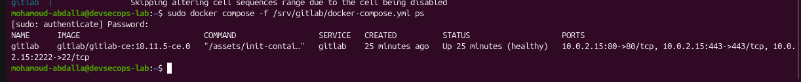
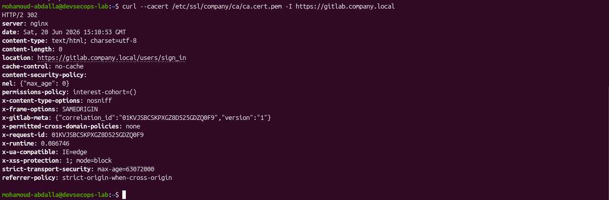
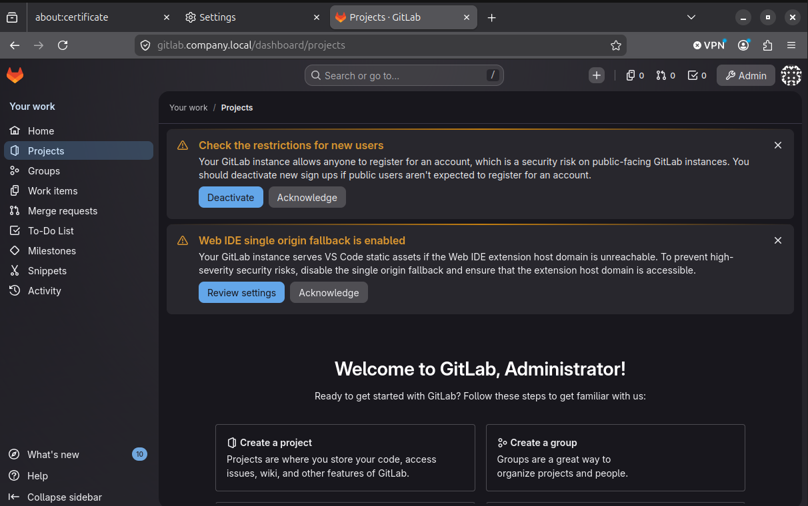

# Phase 1.4 - GitLab CE Deployment And Hardening

In this phase, I deployed GitLab Community Edition as the internal source control and CI/CD platform for my lab. I used Docker Compose, persistent host storage, a pinned image version, and my internal TLS certificate.

## Status

I have completed the GitLab CE deployment and initial security configuration.

Completed work:

- I confirmed the host had sufficient CPU, memory, storage, and free service ports.
- I created persistent GitLab directories with ownership compatible with Docker user namespace remapping.
- I placed the GitLab certificate and private key inside the persistent configuration volume with restricted permissions.
- I created and validated the Docker Compose configuration before deployment.
- I pinned GitLab CE to version `18.11.5-ce.0` and recorded the pulled image digest.
- I bound HTTP, HTTPS, and Git-over-SSH only to the lab IP address.
- I verified that the container reached a healthy state.
- I verified HTTPS against my internal CA without bypassing certificate checks.
- I imported the internal CA into Firefox and confirmed TLS 1.3 browser trust.
- I replaced the temporary administrator password.
- I disabled public user registration and increased the minimum password length.
- I disabled the Web IDE single-origin fallback because its isolated extension host was unavailable.

## Reproducible Image Selection

I used the explicit image tag `gitlab/gitlab-ce:18.11.5-ce.0` instead of an unpinned `latest` tag. After pulling it, I recorded both the local image ID and repository digest.

Original terminal evidence:

## Persistent Storage And User Namespaces

Docker user namespace remapping maps container root to subordinate host UID/GID `100000`. I assigned GitLab's persistent directories to that mapped identity so the container could write its configuration, logs, and application data without disabling user namespace isolation.

Persistent paths:

- `/srv/gitlab/config`
- `/srv/gitlab/logs`
- `/srv/gitlab/data`
- `/srv/gitlab/config/ssl`

The TLS certificate is readable by GitLab, while the private key is restricted to its mapped owner.

## Network Exposure

I bound the published ports to `10.0.2.15` rather than every host interface:

| Host port | Container port | Purpose |
|---|---|---|
| 80 | 80 | HTTP redirect to HTTPS |
| 443 | 443 | GitLab HTTPS |
| 2222 | 22 | Git operations over SSH |

I did not expose additional internal services that were not required.

## Health Verification

I waited for first-run database migrations and configuration tasks to finish, reviewed the logs, and confirmed that Docker reported the service as healthy.

Original terminal evidence:

## HTTPS Verification

I tested the HTTPS endpoint with my internal CA and deliberately avoided `curl -k`. GitLab returned an HTTP `302` redirect to its sign-in page, confirming that NGINX, TLS, certificate validation, and the application route were working.

Original terminal evidence:

I also imported the internal CA into Firefox, removed the earlier browser exception, and confirmed that the site was verified by my Company CA using TLS 1.3.

## Initial Application Hardening

After the first administrator login, I reviewed GitLab's security warnings instead of dismissing them.

I applied these controls:

- Disabled public self-registration
- Increased minimum password length to 14 characters
- Replaced the generated administrator password
- Disabled the Web IDE single-origin fallback
- Kept SMTP and usage reporting disabled for this internal lab

The configured external Web IDE extension host did not resolve from the lab. I chose to disable the fallback and accept temporary loss of the Web IDE rather than serve extension content from GitLab's primary trusted origin.

Original application evidence:

## Security Decisions

- I validated Compose syntax before creating the container.
- I used a pinned image and retained its digest as deployment evidence.
- I preserved Docker user namespace remapping instead of weakening the daemon for application compatibility.
- I restricted published ports to the lab IP.
- I kept the TLS private key out of the repository and limited its filesystem permissions.
- I verified certificates normally rather than bypassing trust checks.
- I prevented uncontrolled account creation.
- I chose browser origin isolation over optional Web IDE functionality.
- I excluded passwords and other secrets from screenshots and documentation.

## Outcome

I now have a healthy internal GitLab CE service available at `https://gitlab.company.local`, protected by trusted internal TLS and initial application security controls. The environment is ready for Phase 1.5 GitLab Runner installation.
